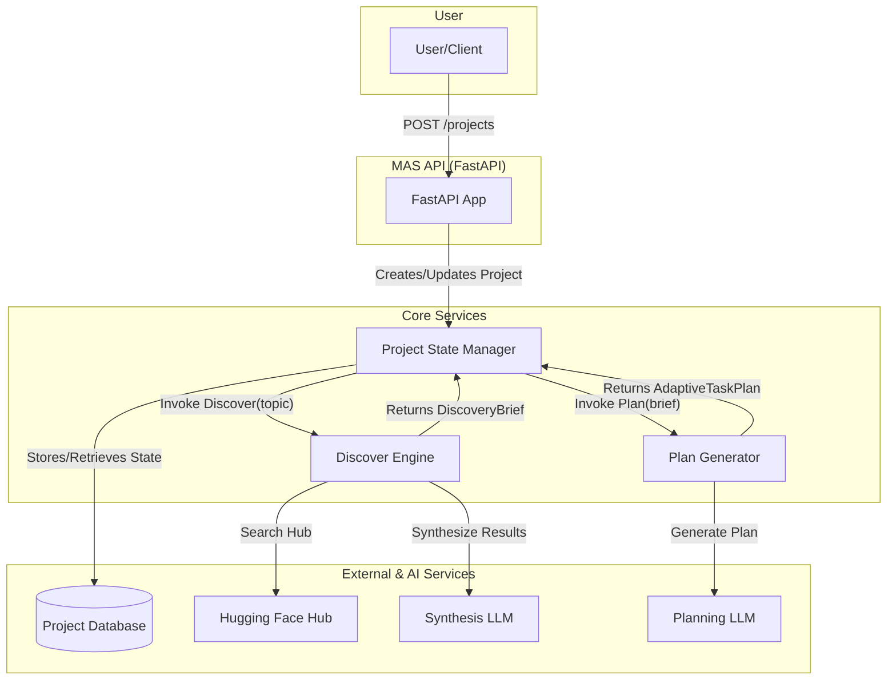

# MAS MVP Component Diagram

This document provides a more detailed look at the components for the Methodology Automation System (MAS) MVP.

## Core Components

### 1. FastAPI Application (Main Entrypoint)
- **Description:** The main web application that exposes the MAS API to the user.
- **Responsibilities:**
    - Handles incoming HTTP requests.
    - Manages API routing to the correct services.
    - Handles user authentication and request validation.
    - Interacts with the Project State Manager to create and manage projects.

### 2. Project State Manager
- **Description:** A persistent service that manages the state of all projects.
- **Responsibilities:**
    - Creates, retrieves, updates, and deletes project records.
    - Stores project artifacts (like the discovery brief and plan).
    - Tracks the current phase and status of each project.
    - Will likely be backed by a simple database (e.g., SQLite for the MVP, PostgreSQL for production).

### 3. Discover Engine
- **Description:** A service dedicated to automating the "Discover" phase.
- **Responsibilities:**
    - Receives a project topic from the Project State Manager.
    - Uses the `HuggingFaceSearchService` to find relevant models and datasets.
    - Uses the `SynthesisService` (powered by an LLM) to generate the text for the discovery brief.
    - Returns the completed `DiscoveryBrief` artifact to the Project State Manager.

### 4. Plan Generator
- **Description:** A service dedicated to automating the "Plan" phase.
- **Responsibilities:**
    - Receives a `DiscoveryBrief` artifact.
    - Uses a `PlanningService` (powered by an LLM) with a specialized prompt to generate a structured "Adaptive Task Plan".
    - Parses and validates the generated plan.
    - Returns the completed `AdaptiveTaskPlan` artifact to the Project State Manager.

## Mermaid Diagram

